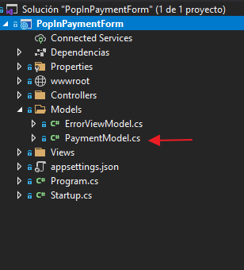
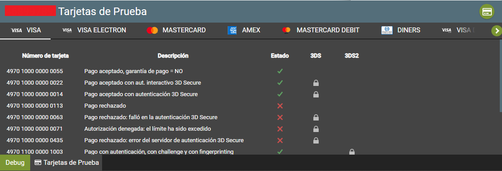

# PopIn-PaymentForm-.Net

<p align="justify">
Ejemplo del formulario en Redirección con C# y el Framework .NET, este ejemplo esta hecho con el lenguaje de programación C# la cual es un multiparadigma y muy sofisticado que ha evolucionado en conjunto con el framework de Microsoft .NET. Tiene nuevas características, como tipos por referencia nullables, rangos, índices y streams asíncronos.
</p> 

<p align="center">
                                               
 </p>                                
          
    
## Este ejemplo es solo una guía para poder realizar la integración de la pasarela de pagos, puede realizar las modificaciones necesarias para su proyecto.       
          
<a name="Requisitos_Previos"></a>

## Requisitos Previos

* Acceso al Back Office Vendedor (BOV) y Claves de autenticación. [Guía Aquí](https://github.com/izipay-pe/obtener-credenciales-de-conexion)
* Instalar Visual Studio [Aquí](https://visualstudio.microsoft.com/es/)
* Version de .NET CORE de 3 en adelante

## 1.- Crear el proyecto
Descargar el proyecto .zip haciendo click [Aquí](https://github.com/izipay-pe/PopIn-PaymentForm.Net/archive/refs/heads/main.zip) o clonarlo desde Git.
```sh
git clone https://github.com/izipay-pe/PopIn-PaymentForm.Net.git
``` 
* Correr con IIS Express de manera Local 
* Ejecútelo y pruébelo con el siguiente comando: `F5` desde la Vista `Home` `Index.cshtml` y abrira con su navegador web predeterminado

  ver el resultado en: "https://localhost:44345/"

## 2.- Configurar datos de conexión

**Nota**: Reemplace **[CHANGE_ME]** con sus credenciales de `API REST` extraídas desde el Back Office Vendedor, ver [Requisitos Previos](#Requisitos_Previos).

* Editar el archivo en la siguiente ruta `PopInPaymentForm -> Models -> PaymentModel.cs` con las claves de su Back Office Vendedor

  

  ```c#   
  public class PaymentModel
      {
          private const string _usuario = "~~CHANGE_ME_USER~~";
          private const string _contraseña = "~~CHANGE_ME_KEY~~";
          private const string _clave_JS = "~~CHANGE_ME_PUBLIC_KEY~~";
          private const string _clave_SHA256 = "~~CHANGE_ME_KEY_HMAC-SHA-256~~";
          private const string _servidor_API = "https://api.micuentaweb.pe/";
       }
  ```

## 3.- Transacción de prueba

El formulario de pago está listo, puede intentar realizar una transacción utilizando una tarjeta de prueba con la barra de herramientas de depuración (en la parte inferior de la página).

  

Para obtener más información, eche un vistazo a:

- [Formulario pop-in: prueba rápida](https://secure.micuentaweb.pe/doc/es-PE/rest/V4.0/javascript/quick_start_popin.html)
- [Primeros pasos: pago simple](https://secure.micuentaweb.pe/doc/es-PE/rest/V4.0/javascript/guide/start.html)
- [Servicios web - referencia de la API REST](https://secure.micuentaweb.pe/doc/es-PE/rest/V4.0/api/reference.html)

NOTA: 

1.- Paso de la tienda al modo PRODUCTION 

     Modifique su implementación para utilizar PopIn:
     * la contraseña de producción,
     * clave pública de producción,
     * la clave HMAC-SHA-256 de producción para calcular la firma contenida en el campo kr-hash.

2.- No tengo una cuenta activa con Izipay. [Suscribete Aquí](https://online.izipay.pe/comprar/cliente)

   | CARACTERÍSTICAS | VALOR |
   | ------------- | ------------- |
   | Usuario de prueba  | 89289758  |
   | Contraseña de prueba  | testpassword_7vAtvN49E8Ad6e6ihMqIOvOHC6QV5YKmIXgxisMm0V7Eq  |
   | Clave pública de prueba  | 89289758:testpublickey_TxzPjl9xKlhM0a6tfSVNilcLTOUZ0ndsTogGTByPUATcE  |
   | Clave HMAC SHA256 de prueba  | fva7JZ2vSY7MhRuOPamu6U5HlpabAoEf8VmFHQupspnXB  |
   | URL de base  | https://api.micuentaweb.pe |

## 4.- Gestionar la notificacion de fin de pago (IPN)

IPN son las siglas de Instant Payment Notification (URL de notificación instantánea, en inglés). Al crear una transacción o cambiar su estado, nuestros servidores emitirán una IPN que llamará a una URL de notificación en sus servidores. Esto le permitirá estar informado en tiempo real de los cambios realizados en una transacción.

Las IPN son la única manera de recibir notificaciones en los casos siguientes:

* La conexión a Internet del comprador se ha cortado.
* El comprador cierra su navegador durante el pago.
* Se ha rechazado una transacción.
* El comprador no ha terminado su pago antes de la expiración de su sesión de pago.

Por lo tanto, es obligatorio integrar las IPN.

   <p align="center">
     
   </p>  

* Ver manual de implementacion de la IPN [Aquí](https://secure.micuentaweb.pe/doc/es-PE/rest/V4.0/kb/payment_done.html)

* Ver el ejemplo de la respuesta IPN con PHP [Aquí](https://github.com/izipay-pe/Redirect-PaymentForm-IpnT1-PHP)

* Ver el ejemplo de la respuesta IPN con NODE.JS [Aquí](https://github.com/izipay-pe/Response-PaymentFormT1-Ipn)
