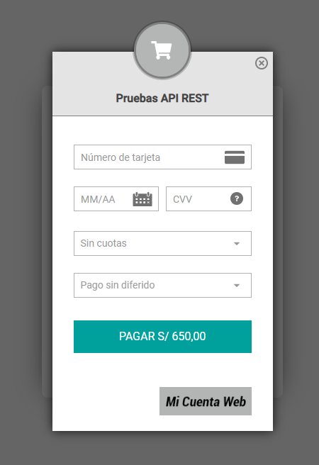
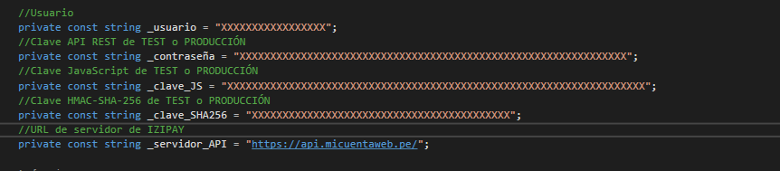
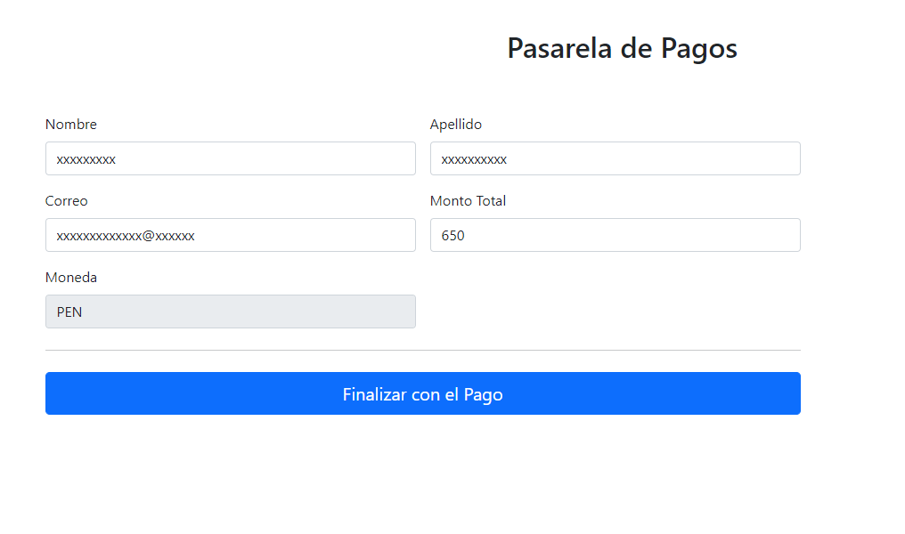

# PopIn-PaymentForm-T1.Net

Ejemplo del formulario POP-IN de Izipay con C# .NET.


## Requisitos Previos

* Servidor Web que soporte Javascript
* Node 16.14 o superior

## 1.- Descargar
Descargar el proyecto .zip haciendo click [Aquí](https://github.com/izipay-pe/Embedded-PaymentForm-T1-React/archive/refs/heads/main.zip) o clonarlo desde Git.
```sh
git clone https://github.com/izipay-pe/Embedded-PaymentForm-T1.Net.git
``` 

## 2.- Obtener Claves
* Obtener claves de integración, [Ver ejemplo](https://github.com/JunioratWork/Obtener_Credenciales#readme)
* Editar el archivo `App.js` con las claves de su Back Office Vendedor
 
## 3.- Configurar Claves


## 4.- Construir proyecto en producción.
```sh
npm run build
``` 

## 5.- Comprimir 
Comprimir la carpeta `build/` que se ha creado con el comando anterior y subirlo a su hosting.

## 6.- Demo

